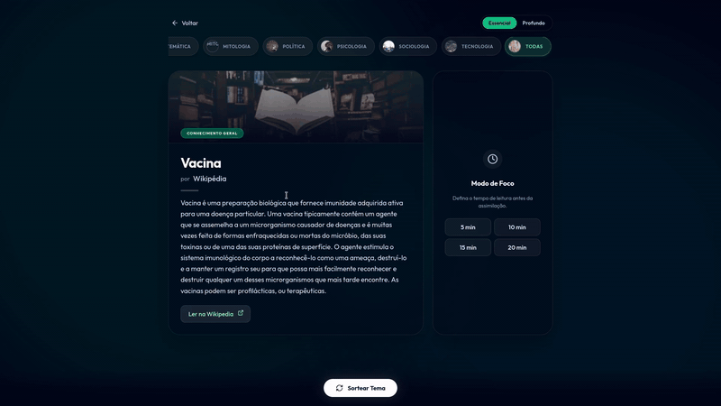

# 🧠 Desemburrar


**Desemburrar** é um *web app* minimalista focado em **microlearning** e na consolidação do conhecimento. Desenvolvido para transformar aqueles 10 minutos ociosos do dia a dia em uma oportunidade de expandir sua bagagem cultural de forma gamificada e sem fadiga de decisão.

<p align="center">
  
</p>

## ✨ Funcionalidades Principais

* 🎲 **Sorteio Curado de Conhecimento:** Centenas de tópicos integrados, de Física Quântica a Movimentos Artísticos. Com apenas um clique, você descobre algo novo sem precisar pesquisar.
* 🎚️ **Níveis de Profundidade:** Alterne entre "Essencial" (fatos rápidos) e "Profundo" (teorias complexas). A UI inteira se adapta dinamicamente (de esmeralda para roxo) baseada na sua escolha.
* 🗂️ **Filtros por Categoria:** Estude o que mais te atrai no momento escolhendo categorias como Filosofia, Ciência, Literatura e Matemática, acompanhadas de imagens fotográficas em alta definição.
* ⏱️ **Modo de Foco & Técnica Feynman:** O grande diferencial da aplicação. 
  * Defina um tempo de leitura ininterrupta (5 a 20 minutos).
  * Ao finalizar, um novo timer de 2 minutos é acionado: a **Fase de Assimilação**. O usuário é desafiado a explicar o conceito recém-lido em voz alta, cimentando o conhecimento no cérebro.
* 🎨 **UI/UX Imersiva:** Design moderno utilizando *Glassmorphism*, paletas dinâmicas, desfoque de fundo (backdrop blur) e animações suaves para máxima imersão.

## 🛠️ Tecnologias Utilizadas

* **React (Hooks, Custom States)**
* **Vite** (Build tool super rápida)
* **Tailwind CSS v4** (Estilização utilitária avançada)
* **Lucide React** (Ícones vetoriais modernos)
* **Unsplash Source** (Imagens temáticas dinâmicas)

## 🚀 Como rodar o projeto localmente

1. Clone este repositório:
```bash
git clone https://github.com/SEU_USUARIO/desemburrar.git
```
2. Acesse a pasta do projeto:
```bash
cd desemburrar
```
3. Instale as dependências:
```bash
npm install
```
4. Inicie o servidor de desenvolvimento:
```bash
npm run dev
```
5. Acesse `http://localhost:5173` no seu navegador.

## 💡 Sobre o Projeto

Este é um projeto pessoal criado para unir a paixão por tecnologia à educação contínua. A ideia surgiu da necessidade de substituir o tempo gasto rolando feeds de redes sociais por um sistema que incentivasse o aprendizado ativo em curtos intervalos de tempo.

---
Desenvolvido com ☕ e código por [Seu Nome](https://linkedin.com/in/seu-perfil).
